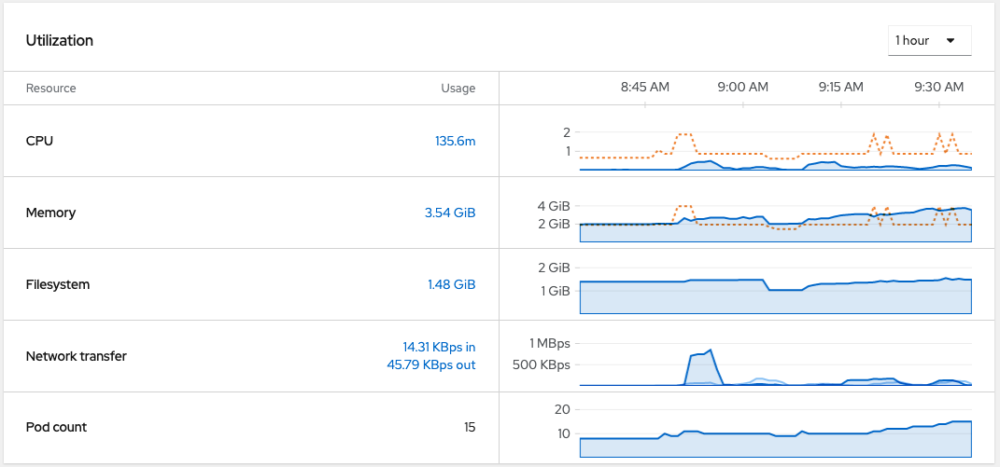
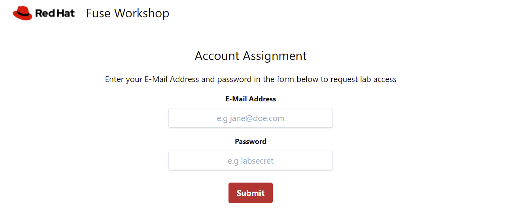

= Camel Spring Boot Workshop
:toc:
:toc-placement!:

Ansibe automation to the deploy Red Hat Fuse Workshop.

toc::[]

== Product versions

* Fuse: 2.10
* Spring Boot: 2
* Java: 11
* AMQ Broker: 7.x
* Codeready Workspaces: latest
* [optional] Camel K: 1.4

== Requirements

=== OpenShift 4.9

This workshops requires a OpenShift environment with users already defined, they must:

- be named as `user + number`, like `user1`
- have the same password: `openshift`.

Have as many as you need for your activity.

Take the above resource consumption as a base to calculate the amount of resource you will need for your workshop.

[NOTE]
====
This workshop is specifically tested with OCP 4.9. Older versions have API incompatibilities that will break the automation and newer versions still not possess some of the operators used in this workshop.
====

=== Resource Consumption per User

=== CodeReady Workspaces

You just need an updated browser, preferably Chrome or Firefox :)

== Using the Ansible playbook

=== Parameters

[options="header"]
|=======================
| Parameter | Example Value                                      | Definition
| ocp_token | sha256~vFanQbthlPKfsaldJT3bdLXIyEkd7ypO_XPygY1DNtQ | Access token for a user with cluster-admin privileges.
| domain    | my-cluster.company.com                             | The cluster's domain. If you have a console URL like this https://console-openshift-console.apps.my-cluster.company.com, your domain is `my-cluster.company.com`.
| num_users | 8                                                  | Number of users attending the workshop. Have in mind that the more users you have, more resources you are going to need from the cluster.
| delete_workshop | false | Only use this parameter if you intend to delete the installation and preserve the cluster.
|=======================

=== Running the playbook

- Replace the environment variable values:

----
token=REPLACE_ME
server=REPLACE_ME
num_users=REPLACE_ME
----

=== Install the Workshop

----
ansible-playbook -e token=${token} -e server=${server} -e num_users=${num_users} playbook.yml
----

=== Delete the workshop:

----
ansible-playbook -e token=${token} -e server=${server} -e num_users=${num_users} -e delete_workshop=true playbook.yml
----

=== Getting the user registration page

The URL will be displayed by the `Installation Finished` task.

