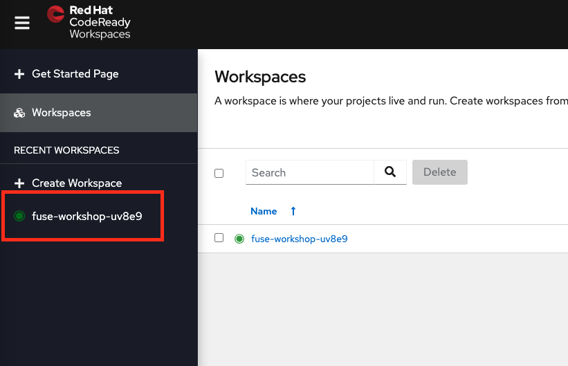

:walkthrough: Setup CodeReady Workspaces with Fuse
:codeready-url: {che-url}
:openshift-url: {openshift-host}
:next-lab-url: ../../../tutorial/fuse-workshop-doc-walkthroughs-01-hello-router/
:user-password: openshift

= Lab 0 - Workshop Introduction

Learn how to set up your environment and tools available for this workshop.

Welcome to the Fuse workshop! It's a pleasure to guide you on this hands-on experience.

This workshop aims to offer you practical experience with Red Hat Fuse. It is not meant to be a complete training of Red Hat Fuse. For this purpose we have an amazing https://www.redhat.com/pt-br/services/training/jb421-red-hat-jboss-fuse-camel-development[official training], covering many aspects of Red Hat Fuse in depth.

The main objective is to cover as many Fuse aspects during this workshop. We will be using a https://github.com/GuilhermeCamposo/fuse-workshop.git[project skeleton] during this lab.

This *fuse-workshop* project is a Red Hat Fuse (aka https://camel.apache.org[Apache Camel]) Spring Boot project, with some code already written for you. It will help you focus on what really matters rather than having you write lots of boilerplate code.

[type=walkthroughResource,serviceName=codeready]
.CodeReady Workspaces
****
* link:{codeready-url}[Console, window="_blank"]
* link:https://developers.redhat.com/products/codeready-workspaces/overview/[Want to know more about CodeReady Workspaces?, window="_blank"]
****

[type=walkthroughResource,serviceName=openshift]
.OpenShift Console
****
* link:{openshift-url}[Console, window="_blank"]
****

.Fuse
****
* link:https://launch.openshift.io[Create new projects using Launcher, window="_blank"]
****

== Requirements

=== Knowledge Requirements

We prepared this content in a way that anyone can execute the labs and get an understanding of what is happening and the desired outcomes.
Although for a better and deeper experience, so previous knowledge is require:

- Basic Java
- Basic Maven

=== Tools Requirements

- You won't need any specific tool installed in your workstation. We only require an updated web browser, preferably Chrome or Firefox.

[time=5]
== Setup CodeReady Workspaces

These walkthroughs use link:https://developers.redhat.com/products/codeready-workspaces/overview[CodeReady Workspaces, window="_blank"] (based on https://www.eclipse.org/che[Eclipse Che]).
It's an IDE on the cloud based on containers. You can also use a local development environment if you'd prefer (i.e. https://code.visualstudio.com[Visual Studio Code], https://developers.redhat.com/products/codeready-studio/overview[Red Hat CodeReady Studio] (formerly known as JBoss Developer Studio), https://www.jetbrains.com/idea[IntelliJ IDEA], etc).

{empty} +

The *fuse-workshop* project is a Camel Spring Boot project, with some code already written for you. It will help you focus on what really matters rather than having you writing lots of boilerplate code.

.Open link:{codeready-url}/dashboard[CodeReady Workspaces, window="_blank"]

{empty} +

Credentials:

* Username: `{user-username}`
* Password: `{user-password}`

{empty} +

On the opened page, click on the workspace as showed in the picture:

{empty} +

When the setup is ready, you should see a screen like this:

{empty} +

Now that you successfully started your workspace, take some time exploring the project structure using the `left menu`.

{empty} +

=== Running the project

On the right menu, click on the cube icon. Under the tools menu, click on `run app locally`. You should see the application build starting and then application running.

{empty} +

As this is a web application, we are going to explore it in future labs, CodeReady Workspaces will suggest to you to open a link. Click on `Open Link`.

{empty} +

In the end you should see a web app on the side menu, and a `hello router` message in the logs.

{empty} +

To stop the application use `Ctrl+C` in the terminal.

[time=5]
[type=verification]
Are you seeing a loop hello message in the logs?

[time=1]
== Summary

Congratulations, you finished the setup of your environment!

In this lab, you learned how to set up a Fuse on Spring Boot project using CodeReady Workspaces.

You can now proceed to `Hello Router Lab`.
