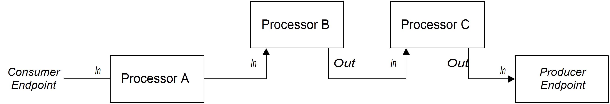

:walkthrough: Hello World Camel
:codeready-url: {che-url}
:openshift-url: {openshift-host}
:next-lab-url: ../../../tutorial/fuse-workshop-doc-walkthroughs-02-files/

= Lab 1 - Hello World Camel

Write your first Red Hat Fuse integration route!

Let's explore a simple scenario where we are going to use a timer component to generate Orders automatically.

[type=walkthroughResource,serviceName=codeready]
.CodeReady Workspaces
****
* link:{codeready-url}[Console, window="_blank"]
* link:https://developers.redhat.com/products/codeready-workspaces/overview/[Want to know more about CodeReady Workspaces?, window="_blank"]
****

[type=walkthroughResource,serviceName=openshift]
.OpenShift Console
****
* link:{openshift-url}[Console, window="_blank"]
****

[type=walkthroughResource]
.Camel Components
****
* link:https://github.com/apache/camel/blob/master/components/readme.adoc[Camel components list, window="_blank"]
****

[time=2]
== Timer component

Using the *fuse-workshop* project, open the class `OrderGenerator.java`. You can use the project navigation to it, or use the short key `CTRL + P` or `CMD + P` and type `OrderGenerator`.
If you are having trouble finding it, look in `src/main/java/com/redhat/workshop/fuse/routers/` folder.

{empty} +

As you can see, this is a very simple Camel Router already defined for you. A Camel Router is a class that extends `RouteBuilder` and implements the configure method. Let's focus on the code that really matters at the moment.

[source,java]
----
from("timer:generate")
.log("Hello router!");
----

{empty} +

This code is using the timer component, with all default configurations. It will be executed every second (default value), printing the message *Hello router!"* in the console.

Components are the key for Camel. They are flexible and reusable "libraries" that abstract complex operations, making it trivial, boosting developer productivity!

https://camel.apache.org/components/latest[Take a look at Camel's components list, window="_blank"]

Now, let's use some parameters with timer component to repeat *only 5 times* within the *interval of 1 sec*.

[source,java]
----
from("timer:generate?repeatCount=5&period=1000")
.log("Hello router!");
----

{empty} +

Enter a *?* after the word *generate* to use the auto complete feature.

image::./images/lab01-autocomplete.png[]

{empty} +

image::./images/camel-structure.png[]

{empty} +

This is the basic of how components work.

Now, run the project. If it's already running, stop it by closing the terminal tab, then click on `run app locally`.

[type=verification]
Do you see 5 *Hello router!* messages on the console?

{empty} +

== Concepts

Think of Camel as a pipeline that transports data *from* a source to *one or more destinations*.

Camel’s syntax is inspired by the UNIX pipeline. In UNIX, we might execute something like `ps -fe | grep foo`. When we run this command, the output of the `ps` command becomes the input to the `grep` command. We “pipe” the output of one command into the input of another command.
This sequence of actions in called `Route`.

This pipeline execution state is tracked in an object called an `Exchange`.

Take some time and take a look at https://access.redhat.com/documentation/en-us/red_hat_fuse/7.10/html/apache_camel_development_guide/basicprinciples[this documentation] to understand better how the Camel routing works.

[type=verification]
Did you check documentation?

[time=10]
== Generating Orders Automatically

Now, take a look in the class `OrderService.java`. It generates an `Order.java` object, alternating some values between *Camel* and *ActiveMQ*.

Let's call this method to get a new Order using the *bean* method. Copy the following code and paste it over the `OrderGenerator.java` route:

[source,java]
----
from("timer:generate?repeatCount=5&period=1000")
    .log("Generating Order...")
    .bean(OrderService.class, "generateOrder")
    .log("Order ${body.item} generated");
----

{empty} +

Now, the route is using the `OrderService` class to generate a new `Order` and print some information in the console. Run the code again.

And... where is the Order object?

If your answer was in the `Message body`, you are right!

[type=verification]
Do you see different Orders by the messages on the console?

[time=1]
== Summary

Congratulations, you finished the Hello World Camel lab!

In this lab you learned about Camel pipelines and how they work. You also learned how to interact with Java Beans directly from the Camel DSL.

You can now proceed to `Working with Files`.
