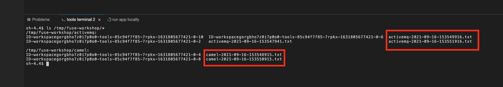

:walkthrough: Integration with Files
:codeready-url: {che-url}
:openshift-url: {openshift-host}
:next-lab-url: ../../../tutorial/workshop_camel-springboot-walkthroughs-03-rest-database/

= Lab 2 - Integration with Files

Explore the basics of Camel using the file system while doing transformations with POJO, XML and JSON.

Contents covered during this lab:

* Content-Based Router pattern
* XML and JSON transformation
* File component
* Processor

[type=walkthroughResource,serviceName=codeready]
.CodeReady Workspaces
****
* link:{codeready-url}[Console, window="_blank"]
* link:https://developers.redhat.com/products/codeready-workspaces/overview/[Want to know more about CodeReady Workspaces?, window="_blank"]
****

[type=walkthroughResource,serviceName=openshift]
.OpenShift Console
****
* link:{openshift-url}[Console, window="_blank"]
****

[time=2]
== Content-Based Router introduction

Content-Based Router (CBR) is a pattern from the link:https://www.enterpriseintegrationpatterns.com[Enterprise Integration Patterns, window="_blank"]. You will use CBR when you need to filter some result and send to a different target based in the filter criteria.

The code below is a CBR sample from the Enterprise Integration Pattern website.

[source,java]
----
from("direct:in")
    .choice()
        .when(header("type").isEqualTo("widget"))
            .to("direct:widget")
        .when(header("type").isEqualTo("gadget"))
            .to("direct:gadget")
        .otherwise()
            .to("direct:other")
----

{empty} +

You will use similar code in this lab.

[time=5]
=== Separating different types of Orders

We will continue to evolve the previous lab. We have five orders being generated automatically by the last lab. In each order generated the item description is different, alternating between *ActiveMQ* and *Camel*.

Let's separate each of these different books with content-based router pattern. But first, let's update the previous router to invoke the one that we will be working on this lab.

Add this line to the previous lab:

[source,java]
----
.to("direct:book-to-file");
----

{empty} +

It must result in the following code

[source,java]
----
from("timer:generate?repeatCount=5&period=1000")
    .log("Generating Order...")
    .bean(OrderService.class, "generateOrder")
    .log("Order ${body.item} generated")
.to("direct:book-to-file");
----

{empty} +

Let's implement the Content-Based Router pattern.
In the same method add the following route:

[source,java]
----
from("direct:book-to-file")
    .choice()
        .when(simple("${body.item} == 'Camel'"))
            .log("Processing a Camel book")
        .otherwise()
            .log("Processing an ActiveMQ book");
----

{empty} +

The `configure()` method should look like this:

{empty} +

We are comparing the *item* attribute of the object Order and printing a message.

Run the integration:

[type=verification]
Do you see both messages *Processing a Camel book* and *Processing an ActiveMQ book* in the log?

[time=5]
== Interacting with Files

https://camel.apache.org/file.html[window="_blank"]

Let's use a new component, *File*, to persist this order on the filesystem. *File* is powerful component that enables us to interact with the file system easily.

To adjust the route to persist the Camel book in the directory `/tmp/fuse-workshop/camel` and the ActiveMQ book in  `/tmp/fuse-workshop/activemq`

{empty} +

Copy and paste the code below:

[source,java]
----
from("direct:book-to-file")
    .choice()
        .when(simple("${body.item} == 'Camel'"))
            .log("Processing a camel book")
            .convertBodyTo(String.class)
            .to("file:/tmp/fuse-workshop/camel")
        .otherwise()
            .log("Processing an activemq book")
            .convertBodyTo(String.class)
            .to("file:/tmp/fuse-workshop/activemq");
----

{empty} +

The line `.convertBodyTo(String.class)` is just invoking the `toString` method on the `Order` class. After that we are saving all files to the filesystem.

Run the integration and check if the files were saved.
To check if the file was save, we are going to list the files of the `/tmp/fuse-workshop` directory.

To open the terminal, click on `New terminal` on the right panel.

{empty} +

Then you can run the following command to list the files:

[source,bash]
----
ls /tmp/fuse-workshop/*
----

{empty} +

[type=verification]
Do you see the files inside the `/tmp/fuse-workshop` directories?

{empty} +

But wait, look at file names! They are auto-generated and weird! Let's fix these exploring some parameters of the file component.

Change the component declaration as following:

Camel:

[source,java]
----
.to("file:/tmp/fuse-workshop/camel?fileName=camel-${date:now:yyyy-MM-dd-HHmmssSSS}.txt")
----

{empty} +

ActiveMQ:

[source,java]
----
.to("file:/tmp/fuse-workshop/activemq?fileName=activemq-${date:now:yyyy-MM-dd-HHmmssSSS}.txt");
----

{empty} +

Run the integration:

[type=verification]
Do you see the files with the new patterns?

[time=10]
== Data Transformation

https://camel.apache.org/data-format.html

Now, let's take the last example and instead of storing everything in *.txt* format, let's transform the Java object in the Message body (`Order.java`).

Let's transform the Camel type to JSON and the ActiveMQ to XML.

To work with Data Format, we have two methods: *marshal()* and *unmarshal()*.

* *marshal()* is used to convert a Java Beans in other datatype as XML, JSON, CSV, etc.
* *unmarshal()* is used when we have a datatype as XML, JSON, CSV, etc, and would like to transform into a Java Object.

{empty} +

Let's remove the transformation of the body to `String` and do a proper transformation.

Update the route to the following:

[source,java]
----
from("direct:book-to-file")
    .choice()
        .when(simple("${body.item} == 'Camel'"))
            .log("Processing a camel book")
            .marshal().json()
            .to("file:/tmp/fuse-workshop/camel?fileName=camel-${date:now:yyyy-MM-dd-HHmmssSSS}.json")
        .otherwise()
            .log("Processing an activemq book")
            .marshal().jacksonxml()
            .to("file:/tmp/fuse-workshop/activemq?fileName=activemq-${date:now:yyyy-MM-dd-HHmmssSSS}.xml");
----

{empty} +

Run the integration and then list the directory again.

[type=verification]
Do you see the files with the correct extensions? Is the content of each file what you would expect?

[time=10]
== Processor and Transformation

Let's add some adrenaline to it! Let's change the `Order` attribute `processed` to `true` for ActiveMQ books.

One way to do it is by using a `Processor`. With a `Processor` you can manipulate the content of an `Exchange` going through the route.

Let's add a Processor, capture `Order` object in the Exchange's body and change the attribute `process` to *`true`*.

Open the `OrderProcessor.java` file and implement the logic to change the attribute `processed` of the `Order` object.

[source,java]
----
Order order = exchange.getIn().getBody(Order.class);
order.setProcessed(true);
System.out.println("attributed process changed");
exchange.getOut().setBody(order);
----

{empty} +

Like this:

{empty} +

In the route, add the process before the first transformation of ActiveMQ books:

[source,java]
----
from("direct:book-to-file")
    .choice()
        .when(simple("${body.item} == 'Camel'"))
            .log("Processing a camel book")
            .marshal().json()
            .to("file:/tmp/fuse-workshop/camel?fileName=camel-${date:now:yyyy-MM-dd-HHmmssSSS}.json")
        .otherwise()
            .log("Processing an activemq book")
            .process(new OrderProcessor()) // ADD THIS LINE
            .marshal().jacksonxml()
            .to("file:/tmp/fuse-workshop/activemq?fileName=activemq-${date:now:yyyy-MM-dd-HHmmssSSS}.xml");
----

{empty} +

Here is how the route will look like:

Run the integration.

[type=verification]
Do you see the last XML files generated with the process attribute is true?

[time=1]
== Summary

Congratulations, you finished the File lab!

We covered a lot of things during this lab. Here's a quick recap:

* Content-Based Router pattern
* XML and JSON transformation
* File component
* Processor (To add some custom logic to your route)

{empty} +

You can now proceed to `REST and Database`.
